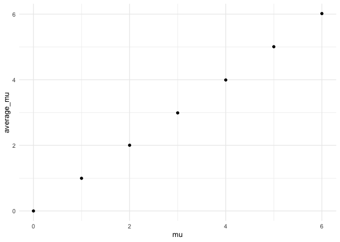

Homework 5: Iteration
================
Kristina Howell

``` r
# These settings will be used throughout the document.

library(tidyverse)
library(rvest)
library(httr)

theme_set(theme_minimal() + theme(legend.position = "bottom"))

options(
  ggplot2.continuous.colour = "viridis", 
  ggplot2.continuous.fill = "viridis"
)

scale_colour_discrete = scale_color_viridis_d
scale_fill_discrete = scale_fill_viridis_d

set.seed(1)
```

## Problem 1

#### Import the dataset

``` r
homicide_df = 
  read_csv("homicide-data.txt") %>% 
  mutate(
    city_state = str_c(city, state, sep = "_"),
    resolved = case_when(
      disposition == "Closed without arrest" ~ "unsolved",
      disposition == "Open/No arrest" ~ "unsolved",
      disposition == "Closed by arrest" ~ "solved"
    )
  ) %>% 
  select(city_state, resolved) %>% 
  filter(city_state != "Tulsa_AL")
```

#### Data description

This dataset was collected by the Washington post with a wide range of
demographic information about each homicide, the victim, and the outcome
of the investigation. It was obtained from the purposes of this report
from a publicly available github repository.

#### Summary Statistics

``` r
aggregate_df = 
homicide_df %>% 
  group_by(city_state) %>% 
  summarize(
    hom_total = n(), 
    hom_unsolved = sum(resolved == "unsolved")
  )
```

#### Prop testing

``` r
prop.test(
  aggregate_df %>% filter(city_state == "Baltimore_MD") %>% pull(hom_unsolved), 
  aggregate_df %>% filter(city_state == "Baltimore_MD") %>% pull(hom_total)) %>% 
  broom::tidy()
```

    ## # A tibble: 1 x 8
    ##   estimate statistic  p.value parameter conf.low conf.high method    alternative
    ##      <dbl>     <dbl>    <dbl>     <int>    <dbl>     <dbl> <chr>     <chr>      
    ## 1    0.646      239. 6.46e-54         1    0.628     0.663 1-sample… two.sided

#### Iteration

``` r
results_df = 
  aggregate_df %>% 
  mutate(
    
    prop_tests = map2(.x = hom_unsolved, 
                      .y = hom_total, 
                      ~prop.test(x = .x, n = .y)), 
    
    tidy_tests = map(.x = prop_tests, 
                     ~broom::tidy(.x))
  ) %>% 
  select(-prop_tests) %>% 
  unnest(tidy_tests) %>% 
  select(city_state, estimate, conf.low, conf.high)
```

#### Data Exploration

``` r
results_df %>% 
  mutate(city_state = fct_reorder(city_state, estimate)) %>% 
  ggplot(aes(x = city_state, y = estimate)) +
           geom_point() +
  geom_errorbar(aes(ymin = conf.low, ymax = conf.high))
```

<!-- -->

## Problem 2

#### Data tidying

``` r
path_df = 
  tibble(path = list.files("./data")) %>% 
  mutate(path = str_c("data/", path),
         data = map(path, read_csv)) %>% 
  unnest(data) %>% 
  separate(path, into = c("x", "study_arm"), sep = 5) %>% 
  separate(study_arm, into = c("study_arm", "subject_id"), sep = "_") %>% 
  separate(subject_id, into = c("subject_id", "y"), sep = 2) %>% 
  select(-x, -y) %>% 
  pivot_longer(week_1:week_8, 
               names_to = "week",
               names_prefix = "week_",
               values_to = "observation")
```

The importing and data tidying process begins by creating a tibble of
the file names and adding the relative path to each file name. The data
is then unnested and the file name is separated into useful columns
(study\_arm, subject\_id). Lastly, the data is pivoted longer, to create
week and observation columns.

#### Creating a spaghetti plot

``` r
path_df %>% 
  group_by(study_arm) %>% 
  ggplot(aes(x = week, y = observation, color = subject_id, group = subject_id)) +
  geom_line() + 
  facet_grid(. ~ study_arm)
```

<!-- -->

describe plot

## Problem 3

#### Function to simulate data and perform t-test

``` r
sim_t_test = function(mu) {
  
  sim_data =   
    tibble(
      x = rnorm(n = 30, mean = mu, sd = 5))
  
  sim_data %>% 
  t.test(y = NULL, 
         conf.level = 0.95) %>% 
    broom::tidy() %>% 
    select(estimate, p.value)
  
}
```

#### Simulate data

``` r
sim_results = 
  
  tibble(
    mu = c(0, 1, 2, 3, 4, 5, 6)) %>% 
  
  mutate(
      output_lists = map(.x = mu, ~ rerun(5000, sim_t_test(.x))), 
      estimate_df = map(output_lists, bind_rows)) %>% 
  
  select(-output_lists) %>% 
  unnest(estimate_df)
```

#### Plots

Y-axis: Proportion of times the null was rejected

X-axis: true value of mu

``` r
sim_results %>% 
   mutate(
    results = case_when(
      p.value < 0.05 ~ "rejected",
       p.value >= 0.05 ~ "not_rejected")) %>% 
  group_by(mu) %>% 
  count(results)
```

    ## # A tibble: 12 x 3
    ## # Groups:   mu [7]
    ##       mu results          n
    ##    <dbl> <chr>        <int>
    ##  1     0 not_rejected  4746
    ##  2     0 rejected       254
    ##  3     1 not_rejected  4055
    ##  4     1 rejected       945
    ##  5     2 not_rejected  2158
    ##  6     2 rejected      2842
    ##  7     3 not_rejected   564
    ##  8     3 rejected      4436
    ##  9     4 not_rejected    41
    ## 10     4 rejected      4959
    ## 11     5 rejected      5000
    ## 12     6 rejected      5000

``` r
###help
```

Y-axis: average estimate of mu

X-axis: true value of mu

``` r
sim_results %>% 
  group_by(mu) %>% 
  summarize(
    average_mu = mean(estimate)) %>% 
  ggplot(aes(x = mu, y = average_mu)) +
  geom_point()
```

<!-- -->

Y-axis: average estimate of mu among null rejected

X-axis: true value of mu

``` r
sim_results %>% 
  filter(p.value < 0.05) %>% 
  group_by(mu) %>% 
  summarize(
    average_mu = mean(estimate)) %>% 
  ggplot(aes(x = mu, y = average_mu)) +
  geom_point()
```

<!-- -->
