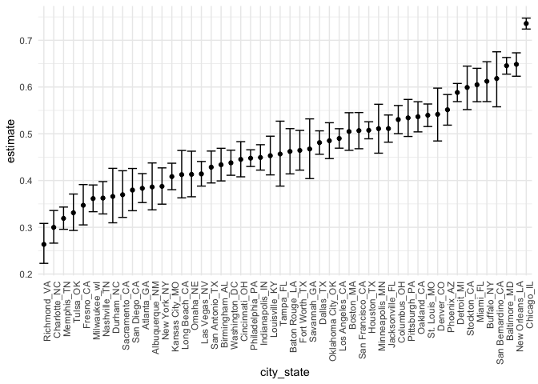
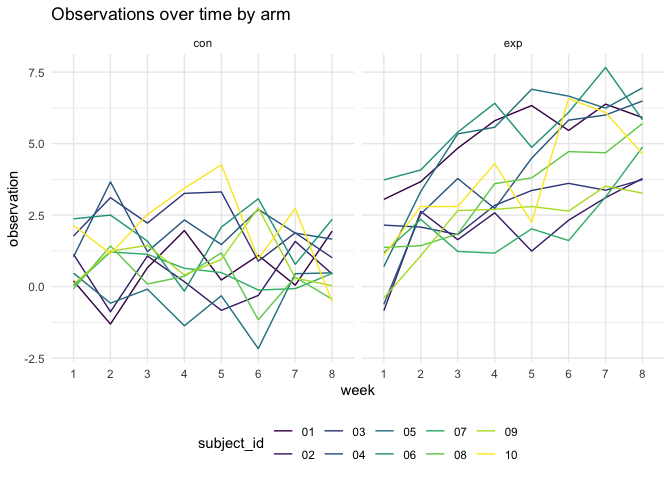
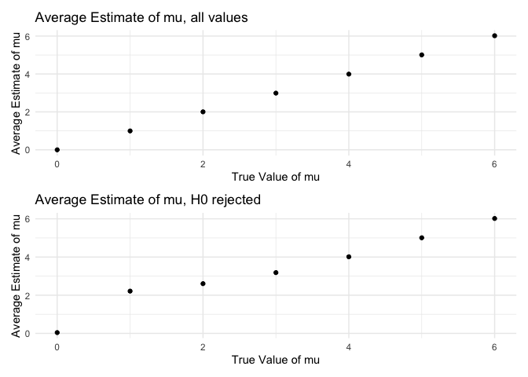

Homework 5: Iteration
================
Kristina Howell

``` r
# These settings will be used throughout the document.

library(tidyverse)
library(rvest)
library(httr)
library(patchwork)

theme_set(theme_minimal() + theme(legend.position = "bottom"))

options(
  ggplot2.continuous.colour = "viridis", 
  ggplot2.continuous.fill = "viridis"
)

scale_colour_discrete = scale_color_viridis_d
scale_fill_discrete = scale_fill_viridis_d

set.seed(1)
```

## Problem 1

#### Import the dataset

``` r
homicide_df = 
  read_csv("homicide-data.txt") %>% 
  mutate(
    city_state = str_c(city, state, sep = "_"),
    resolved = case_when(
      disposition == "Closed without arrest" ~ "unsolved",
      disposition == "Open/No arrest" ~ "unsolved",
      disposition == "Closed by arrest" ~ "solved"
    )
  ) %>% 
  select(city_state, resolved) %>% 
  filter(city_state != "Tulsa_AL")
```

#### Data description

This dataset was collected by the Washington post with a wide range of
demographic information about each homicide, the victim, and the outcome
of the investigation. It was obtained from the purposes of this report
from a publicly available github repository.

#### Summary Statistics

``` r
aggregate_df = 
homicide_df %>% 
  group_by(city_state) %>% 
  summarize(
    hom_total = n(), 
    hom_unsolved = sum(resolved == "unsolved")
  )
```

#### Prop testing

``` r
prop.test(
  aggregate_df %>% filter(city_state == "Baltimore_MD") %>% pull(hom_unsolved), 
  aggregate_df %>% filter(city_state == "Baltimore_MD") %>% pull(hom_total)) %>% 
  broom::tidy()
```

    ## # A tibble: 1 x 8
    ##   estimate statistic  p.value parameter conf.low conf.high method    alternative
    ##      <dbl>     <dbl>    <dbl>     <int>    <dbl>     <dbl> <chr>     <chr>      
    ## 1    0.646      239. 6.46e-54         1    0.628     0.663 1-sample… two.sided

#### Iteration

``` r
results_df = 
  aggregate_df %>% 
  mutate(
    
    prop_tests = map2(.x = hom_unsolved, 
                      .y = hom_total, 
                      ~prop.test(x = .x, n = .y)), 
    
    tidy_tests = map(.x = prop_tests, 
                     ~broom::tidy(.x))
  ) %>% 
  select(-prop_tests) %>% 
  unnest(tidy_tests) %>% 
  select(city_state, estimate, conf.low, conf.high)
```

#### Data Exploration

``` r
results_df %>% 
  mutate(city_state = fct_reorder(city_state, estimate)) %>% 
  ggplot(aes(x = city_state, y = estimate)) +
           geom_point() +
  geom_errorbar(aes(ymin = conf.low, ymax = conf.high)) +
  theme(axis.text.x = element_text(angle = 90, hjust = 1))
```

<!-- -->

## Problem 2

#### Data tidying

``` r
path_df = 
  tibble(path = list.files("./data")) %>% 
  mutate(path = str_c("data/", path),
         data = map(path, read_csv)) %>% 
  unnest(data) %>% 
  separate(path, into = c("x", "study_arm"), sep = 5) %>% 
  separate(study_arm, into = c("study_arm", "subject_id"), sep = "_") %>% 
  separate(subject_id, into = c("subject_id", "y"), sep = 2) %>% 
  select(-x, -y) %>% 
  pivot_longer(week_1:week_8, 
               names_to = "week",
               names_prefix = "week_",
               values_to = "observation")
```

The importing and data tidying process begins by creating a tibble of
the file names and adding the relative path to each file name. The data
is then unnested and the file name is separated into useful columns
(study\_arm, subject\_id). Lastly, the data is pivoted longer to create
week and observation columns.

#### Creating a spaghetti plot

``` r
path_df %>% 
  group_by(study_arm) %>% 
  ggplot(aes(x = week, y = observation, color = subject_id, group = subject_id)) +
  geom_line() + 
  facet_grid(. ~ study_arm)
```

<!-- -->

The observations for both the control and experimental arm of the study
begin around 0 - 2.5, with the experimental arm having a slightly larger
range. The control has some variance over the eight weeks, but maintains
and ends roughly around the same range as it began, 0 - 2.5. The
experimental group drastically increases over the 8 weeks, with some
variance on the individual level, but ends with a higher overall range
of 2.5 - 7.5.

## Problem 3

#### Function to simulate data and perform t-test

``` r
sim_t_test = function(mu) {
  
  sim_data =   
    tibble(
      x = rnorm(n = 30, mean = mu, sd = 5))
  
  sim_data %>% 
  t.test(y = NULL, 
         conf.level = 0.95) %>% 
    broom::tidy() %>% 
    select(estimate, p.value)
  
}
```

The above function creates a tibble generated from a normal distribution
of size 30 and standard deviation 5. It then uses that data to perform a
t-test at alpha = 0.05. Only the estimate and p-value of the t-test are
retained.

#### Simulate data

``` r
sim_results = 
  
  tibble(
    mu = c(0, 1, 2, 3, 4, 5, 6)) %>% 
  
  mutate(
      output_lists = map(.x = mu, ~ rerun(5000, sim_t_test(.x))), 
      estimate_df = map(output_lists, bind_rows)) %>% 
  
  select(-output_lists) %>% 
  unnest(estimate_df)
```

The above code runs a simulation of the function previously created,
sim\_t\_test, with various values of mu for 5000 times. It then binds
the rows of the output and the unnests the data.

#### Plots

Y-axis: Proportion of times the null was rejected

X-axis: true value of mu

``` r
sim_results %>% 
   mutate(
    results = case_when(
      p.value < 0.05 ~ "rejected",
       p.value >= 0.05 ~ "not_rejected")) %>% 
  mutate(results = as.factor(results))
```

    ## # A tibble: 35,000 x 4
    ##       mu estimate p.value results     
    ##    <dbl>    <dbl>   <dbl> <fct>       
    ##  1     0    0.412  0.629  not_rejected
    ##  2     0    0.664  0.368  not_rejected
    ##  3     0    0.551  0.534  not_rejected
    ##  4     0    0.567  0.487  not_rejected
    ##  5     0   -1.65   0.0599 not_rejected
    ##  6     0    1.19   0.229  not_rejected
    ##  7     0    0.334  0.738  not_rejected
    ##  8     0   -1.19   0.209  not_rejected
    ##  9     0    0.122  0.887  not_rejected
    ## 10     0    0.684  0.472  not_rejected
    ## # … with 34,990 more rows

I wish the above plot worked.

``` r
all = sim_results %>% 
        group_by(mu) %>% 
        summarize(
          average_mu = mean(estimate)) %>% 
        ggplot(aes(x = mu, y = average_mu)) +
        geom_point() +
          labs(
          title = "Average Estimate of mu, all values",
          x = "True Value of mu",
          y = "Average Estimate of mu"
          )

some = sim_results %>% 
        filter(p.value < 0.05) %>% 
        group_by(mu) %>% 
        summarize(
          average_mu = mean(estimate)) %>% 
        ggplot(aes(x = mu, y = average_mu)) +
        geom_point() +
          labs(
          title = "Average Estimate of mu, H0 rejected",
          x = "True Value of mu",
          y = "Average Estimate of mu"
          )

all / some
```

<!-- -->

The above set of plots represent the estimated value of mu for the
sim\_results dataset. The **first plot** includes all estimated values
of mu, significant or not at alpha = 0.05. The **second plot** only
includes the estimated values of mu that are significant at an alpha =
0.05.

The sample average of mu across tests for which the null is rejected is
not aprroximately equal to the true value of mu, as it only includes
values that would be large enough to elicit a significance level larger
than 0.05. The sample average of mu across tests is equal to the true
value of mu in the first plot, which includes all values and allows for
the a true calculation of mu derived from all samples.
